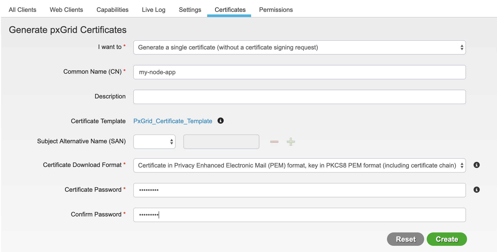
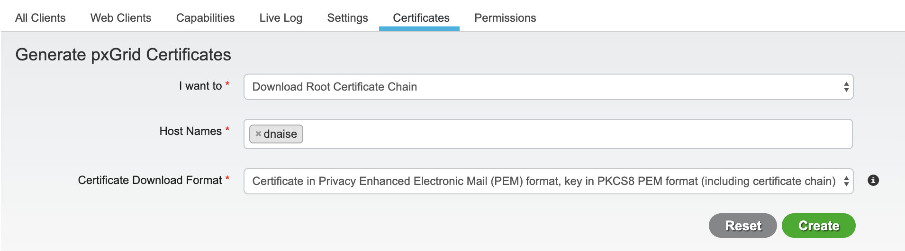
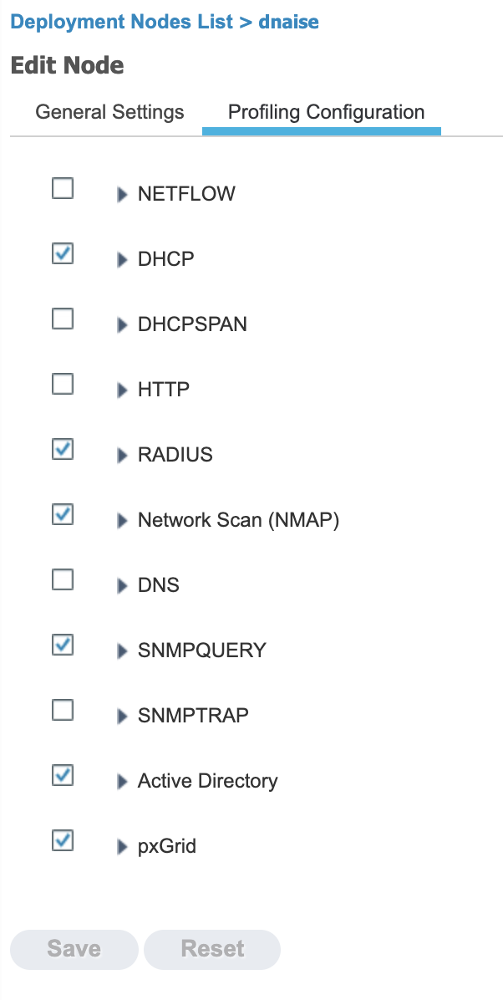
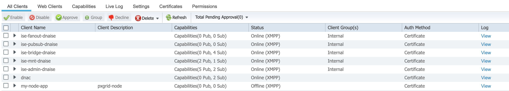

# Setting Up PxGrid on Cisco ISE

## Enable PxGrid Service

Make sure you are running the PxGrid service on at least one ISE node. The PxGrid service is enabled under **Administration > Deployment > \[Node\] > Check off pxGrid**.

<div align="center"></div>

## Setup PxGrid

This is optional, but I typically enable the automatic approval of certificate-based accounts. This saves some time and hassle when using new PxGrid clients that you've already generated certificates for.

Administration > PxGrid Service > Settings tab > Automatically approve new certificate-based accounts

<div align="center"></div>

## Generate a certificate for your client

PxGrid requires a certificate for authentication of both the client and the server. You will need to generate a certificate for your node app to use for pxGrid connectivity. This can be done **Administration > pxGrid Services > Certificates** tab. You can use the following settings (use a name that you want for your node app in place of `my-node-app`).

<div align="center"></div>

Click **Create** and you will download the new certificate in a ZIP file. In this archive, you will have the certificate and key file for your new client, as well as the individual certificates in the trust chain for your certificate. From this, we only need out certificate and key. These should be in the format `my-node-app.cer` and `my-node-app.key`. Store the individual files in a relevant directory to your node app (e.g. `./certs/`). We will get the Root CA Chain later in a single-file bundle.

## Download Root Certificate Chain

Next, we want to download the root certificate chain in a single-file bundle. You can do this from the same screen as above, but by selecting `I want to..` set to **Download Root Certificate Chain**. This should give you a zip file that contains a `.cer` file with the CA bundle. Move this file into the relevant directory for your node app, as well.

<div align="center"></div>

## Import Certificate Files into App

I typically do this in a dedicated file and import it into my app:

```js
const fs = require('fs');

certs = [];
certs.certPath = './certs/';
certs.clientCert = fs.readFileSync(certs.certPath + 'my-node-app.cer');
certs.clientKey = fs.readFileSync(certs.certPath + 'my-node-app.key');
certs.caBundle = fs.readFileSync(certs.certPath + 'ise-chain.cer');

module.exports = certs;
```

Of course, you can do this in your app directly, or however you want. The key thing to note is that the files should be read into the app, and passed to a PxGridControl module. If just referencing a path to the certificate files, it will not work.

## Use them in your app

```js
const certs = require('./certs.js');

const Pxgrid = require('pxgrid-node');

const pxgridControlOptions = {
  host: 'dnaise.ironbowlab.com',
  client: 'my-node-app',
  clientCert: certs.clientCert,
  clientKey: certs.clientKey,
  caBundle: certs.caBundle,
  clientKeyPassword: 'Pxgrid123'
};
const pxcontrol = new Pxgrid.Control(pxgridControlOptions);
const pxclient = new Pxgrid.Client(pxcontrol);

const ancCallback = function(message) {
  console.log(
    'Endpoint ' + body.macAddress + ' has had an ' + body.status + ' ANC event'
  );
};

pxclient
  .connect()
  .then(session => pxclient.subscribeToAncPolicies(session, ancCallback));
```

## Enable pxGrid Profiler Probe

This is optional and only required if you want to **_publish_** asset information into ISE via pxGrid. Profiling (as well as pxGrid) requires the use of a Plus license, and required the Profiling Service to be enabled on your Policy Service node(s).

If you want **_publish_** asset information into ISE via pxGrid, you will need to configure the ISE Policy Service Node(s) (PSNs) in your deployment to use the pxGrid profiler probe. This enables the PSNs to subscribe to the Endpoint Asset topic. **This is not on by default**.

To enable the probe, go to **Administration > System > Deployment**. This will show all of the nodes in your deployment. Click on all nodes running the Policy Service persona in your deployment. Click on the **Profiling Configuration tab**. Check of the option **pxGrid**.

<div align="center"></div>

Note that this is different than enabling the pxGrid persona on a node as we did in the beginning of this guide.

## Try it out

Since we've setup ISE to auto-approve new certificate-based accounts, we should just need to run the app.

```sh
$ node anc_subscriber.py
```

## Confirm client shows up in pxgrid

Now that the client has been activated, we should see it in our pxGrid dashboard (**Administration > pxGrid Services > All Clients tab**).

<div align="center"></div>
